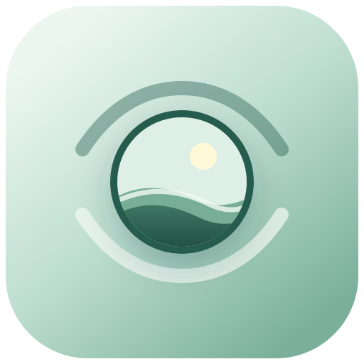

<div align="center">
  
  <h1>护眼助手</h1>
  <p>把远眺这件小事，交给一个安静的提醒。</p>
  <p><strong>专注二十分钟，望向远处二十秒。</strong></p>
</div>

> 当前为 `0.3.0` Windows 预览版。自动构建环境为 Windows 11 x64；真实 Windows 10/11 设备验收状态以 Release 说明为准。

护眼助手（eye-protection-assistant）是个常驻 Windows 系统托盘的小工具。它每专注 20 分钟，就邀请你望向远处 20 秒；休息画面会铺满每一块屏幕，让这二十秒不被顺手略过。计时胶囊可拖动、可隐藏、会记住你的位置；关掉窗口进度也不丢，锁屏或睡眠后会按设置恢复。不弹窗催促、不联网、不收集你的数据，只安静地替你记得休息。

eye-protection-assistant — a quiet Windows tray app that reminds you to look away for 20 seconds every 20 minutes. Full-screen breaks on every display, draggable timer, no disruptive pop-ups, fully offline after installation.

## 屏幕不会提醒你休息

我们通常不是不知道眼睛需要休息，只是在投入之后，很容易忘记时间。

护眼助手不会频繁弹窗，也不会催促你完成更多事情。它只在屏幕一角安静地记住时间；二十分钟后，替你挡住片刻纷扰，邀请你望向远处。二十秒结束，它会自然退场，让下一轮专注自己开始。

这不是一个要求你自律的倒计时，而是一个愿意替你记得休息的小工具。

## 它会怎样陪你

**专注时，尽量不打扰。** 计时留在一枚小胶囊里。它可以拖动、隐藏，也会记住你习惯放置的位置。

**该休息时，认真提醒。** 休息画面会出现在每一块显示器上，让这二十秒不那么容易被顺手略过。如果确实需要提前结束，也会先问你一次。

**休息之后，不打断节奏。** 倒计时结束，画面自动离开，新一轮计时随即开始。你不需要反复点击和重新设置。

**窗口关了，它仍然记得。** 主页面可以随时关闭，当前进度会继续留在菜单栏。隐藏或关闭计时胶囊时，主页面不会被打扰式地重新弹出。

**离开电脑之后，也按你的习惯回来。** 解锁或唤醒 Windows 时，会按照你的恢复设置处理当前计时。

## 不联网，也不认识你

护眼助手不要求注册，不显示广告，也不会把使用情况传到别处。

- 设置与胶囊位置只保存在这台电脑上。
- 没有网络时，计时、休息画面、图标和提示仍然可用。
- 通知权限不是必需的；即使拒绝，主要功能也不会失效。

## 开始使用

当前支持目标：

- Windows 10 22H2 或 Windows 11
- x86-64 处理器
- Microsoft Edge WebView2 Runtime

Windows on ARM、32 位 Windows、Windows 8 及更早版本不在本轮支持范围。真实设备尚未完成的项目会在 Release 说明中明确标为未验证。

前往 GitHub 的 **Releases** 页面，下载：

```text
护眼助手-v0.3.0-Windows-x64-setup.exe
```

运行安装器后，从开始菜单启动护眼助手。安装器采用当前用户安装，不需要为应用本身授予管理员权限。

### 第一次打开时

当前预览版尚未提供 Windows 代码签名，SmartScreen 可能提示发布者未知。建议只从本仓库 Releases 页面下载安装包，并核对同时提供的 SHA-256 校验值。

## 用起来很简单

1. 选择一次专注与休息的时长。
2. 点击“开始专注”。主页面会收起，计时胶囊留在屏幕上。
3. 需要离开时，可以暂停；回来后继续即可。
4. 时间到了，望向窗外、远处的墙面，或者任何比屏幕更远的地方。
5. 休息结束后，继续手上的事情。

默认节奏是工作 20 分钟、休息 20 秒。工作时间可以设为 1–120 分钟，休息时间可以设为 5–300 秒。中文、英文、浅色、深色以及减少动态效果都会跟随你的选择或系统习惯。

## 快捷键

| 快捷键 | 做什么 |
| --- | --- |
| `Ctrl + ,` | 打开设置 |
| `Space` / `Ctrl + P` | 暂停或继续 |
| `Escape` | 关闭当前临时面板 |
| `Ctrl + Q` | 退出护眼助手 |

## 当前版本

这是护眼助手 Windows 兼容工作的公开预览版本。睡眠唤醒、多显示器插拔、不同缩放比例和标准全屏窗口等情况已经纳入设计，但仍需要真实 Windows 设备反馈。

如果你遇到不自然的提醒、无法恢复的窗口、显示器覆盖问题，或只是觉得某个细节不够舒服，欢迎在 Issues 中告诉我们。好的护眼提醒不应该靠堆叠功能完成，而应该在每天使用时让人几乎感觉不到负担。

## 一起把它做得更好

如果你愿意一起改善护眼助手，无论是修正一个细节、调整一句话，还是让某种使用场景更自然，都很欢迎。

开始之前，可以先读一读[贡献指南](.github/CONTRIBUTING.md)。如果发现与隐私或安全有关的问题，请通过[安全策略](.github/SECURITY.md)中说明的方式联系我们，而不要直接公开细节。

护眼助手以 [CC0 1.0 Universal](LICENSE) 方式开放，希望它能够被自由使用、改进和分享。
